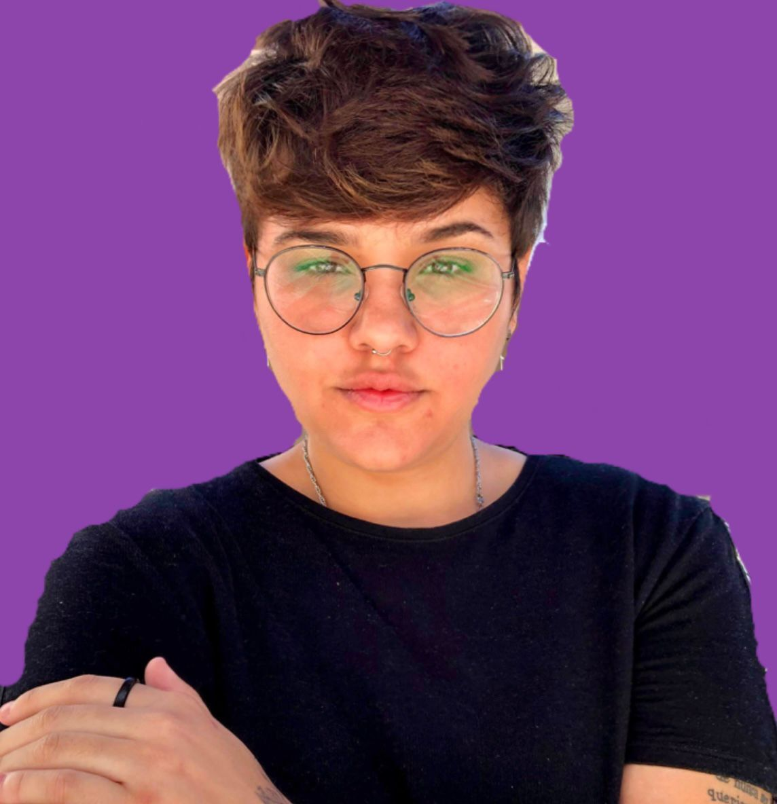

## DEV Gabriela Sene

  # Bem-vindos a minha página!
  
   

  
  
  
  
  
   
   
  
  

   

  **Projetos feitos até agora:** 3 (três) projetos

   
    
  A rede social *Espectro* pode ser visitada [aqui](https://devgabrielasene.github.io/espectro/)

   

  A dashboard de dados *Data-Lovers Rick and Morty* pode ser visitada [aqui](https://devgabrielasene.github.io/data-lovers/)

   

  O projeto cipher *Levante Popular* pode ser visitado [aqui](https://devgabrielasene.github.io/cipher-gabriela/)

## Índice

* [1. Prefácio](#1-prefácio)
* [2. About me](#2-about-me)
***

## 1. Prefácio
Essa página tem o objetivo de mostrar um pouco da minha jornada de transição para a área tech, desde os projetos que foram realizados no Bootcamp da Laboratória durante 6 meses, até o momento atual em conjunto com os meus projetos que serão desenvolvidos ao longo dessa trajetória.

## 2. About me

Olá! Eu sou a Gabriela Sene, mas gosto de Gabi. Eu venho da área de Customer Success, a qual atuei durante quase 6 anos, até que assumi o risco e transformar meu sonho de trabalhar com tecnologia, em meta. Você pode conhecer um pouco mais da minha jornada profissional pelo meu [linkedin](https://www.linkedin.com/in/gabriela-sene/), também podemos tomar um café, networking é sempre bem-vindo! Eu sou uma pessoa bastante engajada, desafios me brilham os olhos porque são nesses momentos em que preciso conciliar o aprendizado com a entrega de resultados, que descubro um pouco mais da minha potência. Comunicação é um dos meus pontos mais fortes e minha história até aqui mostra muito da minha determinação, acredito que posso ocupar os lugares que almejo, para isso conto com minha resiliência, vontade de fazer acontecer e as boas oportunidades que a vida apresenta e eu abraço! Sou muito fã de jogos de tabuleiros, em especial xadrez e WAR. Gosto muito de escrever e isso me levou a publicar um livro em 2020, você consegue encontrar meu livro [aqui](https://www.editoragataria.com.br/minhas-aguas-tambem-sao-nossas-de-gabriela-sene/p) e também criei um canal de podcast no [Spotify](https://open.spotify.com/show/4lvalSvVRUfH0o2MzssdjB) para recitar meus textos autorais. Sou fã do bom humor para aliviar o peso de alguns dias e muito motivada! 

    

